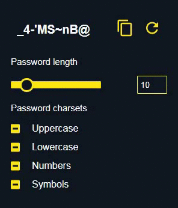

# Password Generator

A ~~chrome~~ browser extension for generating random passwords.

# Install 

- [Chrome Web Store](https://chrome.google.com/webstore/detail/aolabpnafdepgahhdebhhbcbdnkojmgp) 
- [Firefox Addon](https://addons.mozilla.org/addon/quickpass-password-generator/) 

- If you would like to play around with the code in your local machine, you can clone this repo and:
    - Use [web-ext](https://github.com/mozilla/web-ext) in Firefox
    - [Load an unpacked extension](https://developer.chrome.com/extensions/getstarted#manifest) in chrome

## TODO
- [ ] Add more constraints.
- [ ] Allow user to enter own charset.
- [ ] Add bulk generate option.
